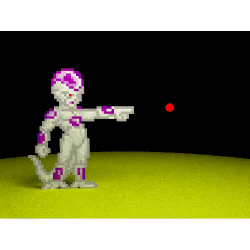

# rayrender experiments </a>

<!-- badges: start -->

<!-- badges: end -->

Playing with [@tylermorganwall](https://twitter.com/tylermorganwall)'s rayrender R package to render cool and weird things. I will update this repository with new scenes or animations, I hope you like it!

* **Mario and Goombas**. Mario dodging some Goombas and jumping to hit the interrogation block. Will there be a mushroom inside?

</a>

* **Link and Navi**. _"Hey!"_, _"Listen"_, _"Watch out!"_, _"Look!"_, etc. Shut the fuck up Navi, I don't want to hear you anymore!

</a>

* **Freezer**. _"Namek will blow up in 5 minutes!"_ Yeah, sure...

</a>

I've had to change the resulting animations from MP4 to GIF so that they can be displayed correctly here. The animations are not so smooth, but if you want to download and view the original animations, you can do it through the corresponding folders.

